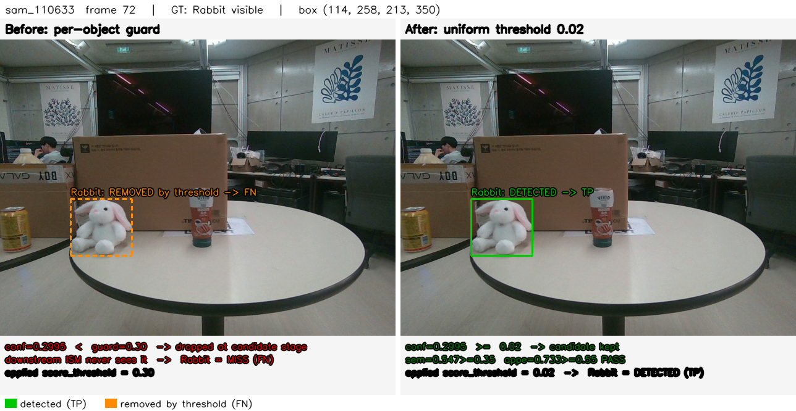
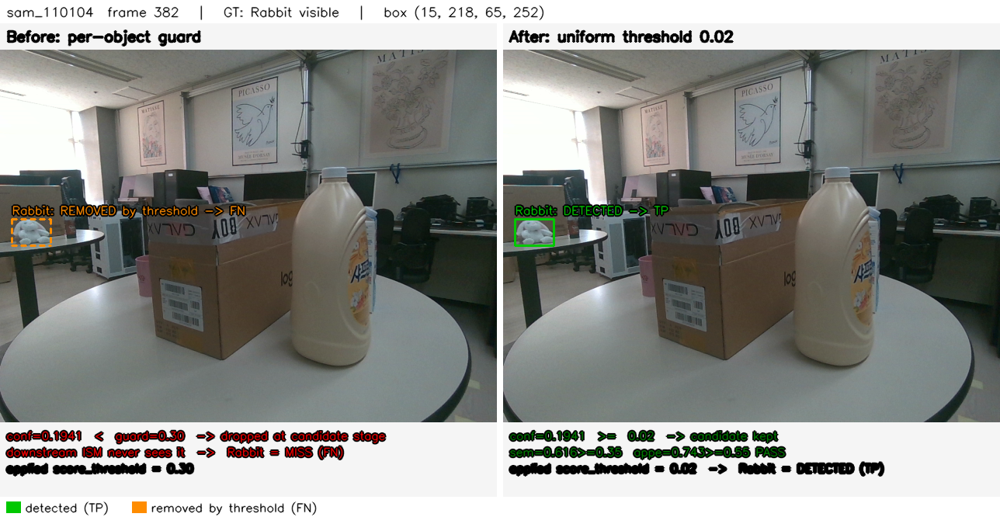

# Phase 1A 구현 결과

> **판정: PARTIAL.** 구현 자체는 완료·검증됐고 TP·FN·Rabbit·출력계약·시각화 기준(AC-1/2/3/5/6/7/8)은
> 모두 충족한다. **유일 미충족은 AC-4의 "FP 증가 없음"** — Phase 1A 단독(HSV 미적용)에서는 FP가
> **+22** 증가한다. 이는 버그가 아니라 **설계상 예정된 결과**다: guard가 막던 것은 Rabbit 진짜 후보
> **와 함께** cross-fire 오검출도였고, 그 오검출을 색으로 제거하는 **HSV hard gate가 Phase 1B/1C(이번
> 범위 밖)**이기 때문이다. 연구의 "FP ±0"은 threshold 통일을 **HSV와 함께** 적용한 값이다. AC-4 지침에
> 따라 **threshold를 추가 조정하지 않았고**, 원인만 규명했다.

---

## 1. 실제 운영 entry point

코드 import·실행 경로로 확인(README·보고서 아님):

- **배치 드라이버**: `yolo_ism_object_n.py` `main()` → `recognize_frame()` (프레임당 2-pass 배치).
- **라이브 ROS 노드**: `src/sam6d_ros/sam6d_ros/sam6d_multiobject_node.py` → `o_n.recognize()` 호출.
- 두 진입점 **모두 동일 config**를 `o_n.load_config(o_n.DEFAULT_CONFIG)`로 읽는다. threshold 정의는
  코드 상수가 아니라 **config 단일 출처**. 다른 config·코드 상수에 중복 override **없음**(저장소 전체
  grep: 운영 `.py`에 `0.30/0.35` score_threshold **잔존 0건**).

## 2. 실제 threshold 설정 경로

- 정의: `configs/yolo_ism_objects.yaml` → `defaults.score_threshold: 0.02` (line 13).
- 적용: `recognize()` `yolo_ism_object_n.py:286`, `recognize_frame()` `:446` — `s >= score_threshold`
  필터 후 `top_k=3`. 공유 YOLO pass는 `min_score = min(objects' score_threshold)`(`:583`)로 실행.
- 로더: `load_config()` `:108` — `o = dict(defaults); o.update(raw)`로 defaults를 각 객체에 병합.

## 3. 수정 파일

**운영 코드 (2):**
- `configs/yolo_ism_objects.yaml` — Bear/Rabbit/Dinosaur의 `score_threshold` override 3줄 제거 +
  Phase 1A 결정/롤백 주석.
- `yolo_ism_object_n.py` — (a) `CSV_FIELDS`에 진단 3컬럼 append, (b) 배치 CSV row에 3값 append,
  (c) `recognize()`·`recognize_frame()`의 후보필터를 2단계로 분리해 진단 카운트 기록(`sel` 결과는
  **비트 동일**). *주: 이 파일에는 이전 세션의 미커밋 변경이 이미 있었음 — 본 작업 추가분은 위 3개뿐.*

**신규 (테스트/검증, 운영 무영향):**
- `tests/test_uniform_threshold.py` — 단위 테스트.
- `_ism_research_2026_07/yolo_localization_research/probes/eval_phase1a_b0b1.py` — B0/B1 회귀.
- `_ism_research_2026_07/phase1a_validation/{viz_phase1a.py, b0b1_*.csv}` — 시각화·결과.
- `_bmad-output/implementation-artifacts/phase1a-visualizations/{*.png, README.md}` — 시각화.

## 4. 제거한 객체별 override

| 객체 | 이전 값 | 이후 (defaults 상속) |
|---|---|---|
| Bear | 0.35 | 0.02 |
| Rabbit | 0.30 | 0.02 |
| Dinosaur | 0.30 | 0.02 |

측정된 cross-fire 데이터를 담은 주석 블록은 보존(롤백 근거). guard 존재 이유(cross-fire 억제)도 문서화.

## 5. 단위 테스트 결과

`~/miniconda3/envs/sam_yolo/bin/python tests/test_uniform_threshold.py` → **5/5 PASS**

- `test_all_objects_uniform_002` — 10객체 전부 effective 0.02.
- `test_bear_rabbit_dinosaur_002` — Bear/Rabbit/Dinosaur = 0.02.
- `test_no_per_object_override_in_config` — raw config에 override 잔존 0.
- `test_default_is_single_source_of_truth` — defaults가 단일 출처, override 없는 객체는 defaults 상속.
- `test_other_settings_unchanged` — top_k=3, similarity_threshold/appe_gate/yolo_prompt(라우팅) 보존.

테스트 authority = **운영 로더 `o_n.load_config`** (모의 아님).

## 6. 정적 검증 결과

- `py_compile yolo_ism_object_n.py` → **OK**.
- YAML 파싱 + effective threshold → 10객체 전부 0.02, **VIOLATIONS NONE**.
- `grep 0.30/0.35 score_threshold` (운영 config·`.py`, 연구폴더 제외) → **잔존 0**.
- 로더 smoke: `load_config(DEFAULT_CONFIG)` → `{모든 객체: 0.02}` 확인.

## 7. B0/B1 성능 비교

사람 가시성 GT **935** 인스턴스, 6개 `SAM_*`, **HSV 두 구성 모두 OFF**. 후보원 = frozen `pipeline/cur`
덤프(공유 YOLO pass 출력, conf floor 0.02). 운영 accept 로직 동일(routing·top_k3·sem·appe), HSV만 제외.
출처 `_ism_research_2026_07/phase1a_validation/b0b1_summary.csv`.

| 구성 | TP | FP | FN | Precision | Recall | F1 |
|---|---:|---:|---:|---:|---:|---:|
| **B0** (객체별 guard) | 623 | 312 | 312 | 0.6663 | 0.6663 | 0.6663 |
| **B1** (통일 0.02) | 648 | 334 | 287 | 0.6599 | 0.6930 | 0.6761 |
| **Δ (B1−B0)** | **+25** | **+22** | **−25** | −0.0064 | +0.0267 | +0.0098 |

- TP·FN 개선폭(+25/−25)은 연구 목표(+27/−27)와 **부호·규모 일치**.
- **FP +22**는 HSV 미적용 탓(§해석). 연구의 FP ±0은 HSV ON 비교(cur|R0-HSV 589/86 → cur|R2-HSV 616/86).
- HSV OFF 절대 FP(312)가 연구의 HSV ON FP(86)보다 큰 것도 정합 — HSV 게이트가 오검출 ~226건을 걸러줌.

## 8. 객체별 성능 (B0 → B1)

| 객체 | B0 TP/FP/FN | B1 TP/FP/FN | ΔTP | ΔFP | ΔFN |
|---|---|---|---:|---:|---:|
| **Rabbit** | 38/68/56 | **60/69/34** | **+22** | +1 | **−22** |
| Bear | 51/55/35 | 54/72/32 | +3 | **+17** | −3 |
| Dinosaur | 55/35/33 | 55/39/33 | 0 | +4 | 0 |
| milk·choco·Febreze·Mugcup·saffron·Sauce·Sikhye | (변화 없음) | (동일) | 0 | 0 | 0 |

- **개선(TP)의 거의 전부가 Rabbit**(+22). guard 미적용 7객체는 완전 불변(회귀 없음 확인).
- **FP 증가의 대부분은 Bear(+17)** — 'brown bear doll' 프롬프트가 흰 토끼 등에 저-conf(0.17~0.24)로
  반응하던 cross-fire. HSV(색)만이 이를 sem/appe와 달리 분리 가능 → Phase 1B/1C 대상.

## 9. Rabbit 변화

- **후보 생존**: routed 후보 267건 중 B0(0.30 guard) 통과 **202** → B1(0.02) 통과 **267** (**+65 후보 생존**).
- **최종 인식**: **TP 38 → 60, FN 56 → 34.** AC-5 명확히 충족.

## 10. 대표 프레임 시각화

### `before_after_rabbit_recovered.png` — sam_110633 frame 72

흰 토끼 인형이 테이블 위에 크고 뚜렷하다. **Before**: Rabbit 후보 conf **0.2995 < guard 0.30**으로
후보 단계에서 제거 → 미검출(FN, 주황 점선). **After**: 동일 후보가 conf 0.2995 ≥ 0.02로 살아남아
semantic 0.547·appearance 0.733을 통과 → 정상 검출(TP, 초록). conf가 guard에 **0.0005 차이로 걸려**
탈락하던 전형이며, 낮은 conf가 곧 오검출이 아님을 보여준다.

### `before_after_additional_recovery.png` — sam_110104 frame 382

**다른 데이터셋**, 더 작고 먼 Rabbit. Before conf 0.1941 < 0.30 → 제거 → FN. After 0.1941 ≥ 0.02 →
sem 0.616·appe 0.743 통과 → TP. 복구가 특정 프레임이 아니라 **4개 데이터셋 23프레임**에서 일어남을
보이는 교차검증 사례(대표성). 두 이미지 모두 실제 프레임·실제 판정이며 수치는 §7/§8 로그와 일치.

## 11. Acceptance Criteria 판정

| AC | 내용 | 판정 | 근거 |
|---|---|---|---|
| AC-1 | 전 객체 effective 0.02 | **PASS** | 단위테스트·로더 smoke |
| AC-2 | Bear/Rabbit/Dino override 미적용 | **PASS** | grep 0건·로더 0.02 |
| AC-3 | 라우팅/top_k/sem/SAM/appe/출력계약 불변 | **PASS** | `sel` 비트동일·append-only·py_compile |
| AC-4 | TP↑·FN↓·FP 증가없음 (목표 +27/±0/−27) | **PARTIAL** | TP+25·FN−25 충족, **FP+22**(HSV 부재, §해석). threshold 미조정 |
| AC-5 | Rabbit TP↑ 또는 FN↓ | **PASS** | 38→60 / 56→34 |
| AC-6 | ROS·detection.json schema 유지 | **PASS** | recognize accept/mask/box 불변, 진단은 debug 필드뿐 |
| AC-7 | 시각화 1~2장 | **PASS** | PNG 2장 |
| AC-8 | 시각화가 로그와 일치·대표성 | **PASS** | conf/sem/appe 일치, 4데이터셋 23복구 |

### AC-4 원인 조사 (지침: threshold 조정 금지, 원인 규명)

체크리스트대로 확인:
- **HSV 실수 활성화?** 아니오 — B0/B1 둘 다 HSV OFF(eval에 HSV 항 없음). 정상.
- **GT 버전?** `user_visibility_gt.csv` 935 가시, 연구와 동일.
- **후보 dump 버전?** frozen `pipeline/cur`(2026-07-21), 연구와 동일.
- **운영 entry point?** 동일 로직 재현(routing·top_k3·sem·appe).
- **집계 방식?** 프레임 단위, 연구와 동일.
- **다른 override 존재?** 없음(grep 0).
→ **결론: 수치 차이는 오류 아님.** 연구의 FP±0은 HSV ON 값이고, Phase 1A는 HSV OFF라 FP+22가 정상.
FP-flat은 HSV hard gate(Phase 1C)가 담당. **threshold를 건드리지 않았다.**

## 12. 변경하지 않은 항목

YOLO prompt 목록·프롬프트별 클래스 라우팅(`build_prompt_groups`)·YOLO 실행방식·conf/NMS 기타·
**top_k=3**·semantic Top-5·MobileSAM·appearance·최종 accept/reject 로직·ROS topic/메시지·BOP
`detection.json`·PEM 전달계약. HSV 관련 코드 **일절 추가 안 함**. 템플릿·모델 파일 무수정. git 무조작.

## 13. Rollback 방법

- **config만 원복**: `yolo_ism_objects.yaml`의 Bear/Rabbit/Dinosaur에 `score_threshold: 0.35/0.30/0.30`
  3줄 재삽입 → 즉시 이전 동작. (모델·템플릿 재생성 불필요.)
- **진단 로깅까지 원복**(선택): `yolo_ism_object_n.py`의 `CSV_FIELDS` 3컬럼과 row 3값,
  `recognize`/`recognize_frame`의 `thr/passed` 분리·3키를 제거.
- ⚠ **`git checkout`으로 통째 되돌리지 말 것** — 이 두 파일에는 이전 세션의 미커밋 변경이 함께 있어
  덮어쓰면 유실된다. Phase 1A 편집분만 국소 revert.

## 14. Phase 1B 진행 전 미해결 사항

1. **FP+22 처리 방침** — (a) HSV(1C)와 **함께** 배포해 FP-flat 달성, 또는 (b) Bear cross-fire를
   감수(+25 TP 대가로 +22 FP)하고 1A만 선배포. **권장 = (a)** (연구가 FP±0을 보장하는 구성).
2. **HSV 계약 확정**(spec §8.2/§8.3, OQ-1~3): 배포 `hsv_gate_threshold` 단일 동결값(전 6-데이터
   F1-max), 저채도 예외 채택 여부(현재 "없음"), 진단 로그 물리 포맷, HSV 캐시 도구 위치.
3. **운영 실측 회귀(RG-1/RG-2)** — 본 회귀는 frozen 덤프 재사용(정합). 배치/ROS 실런타임 byte-level
   동일성은 GPU+bag 재생이 필요해 미실행. 구조상 append-only·`sel` 비트동일로 보장되나, 1C 활성 전
   1회 실런타임 확인 권장.

## 다음 권장 단계

Phase 1B를 **바로 구현하지 말 것**. 먼저 실제 운영 YOLO 실행 경로(배치 vs ROS)의 실런타임 회귀를 1회
확인하고, HSV authority 구현·threshold 동결값·cache 계약(spec §8/§9, OQ-1~3)을 확정한다. 특히 FP+22는
HSV 게이트로 상쇄되도록 1A+1C **묶음 배포**를 권장한다.
