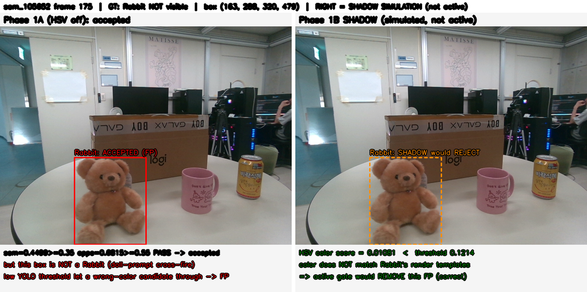
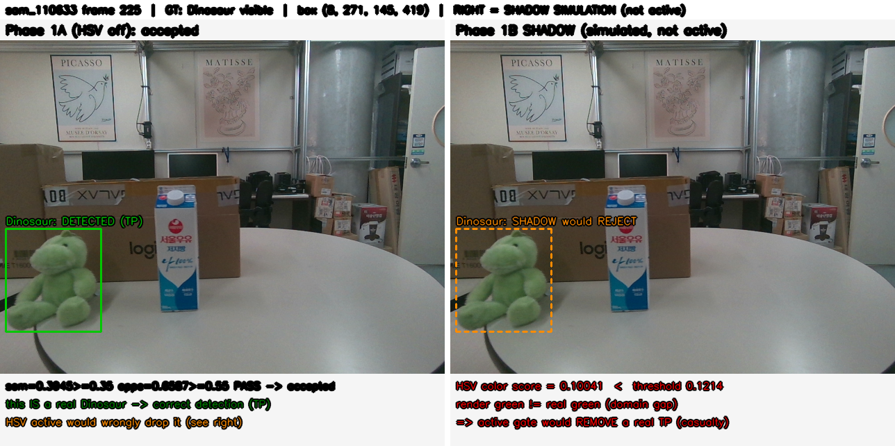

# Phase 1B 구현 결과 — HSV shadow mode

> **판정: PASS.** HSV authority를 운영 코드로 이식하고(연구값과 **완전 일치, 0 flip/18060**),
> 템플릿 캐시·threshold 동결·shadow 로깅·실런타임 회귀를 모두 완료했다. **최종 판정은 바뀌지 않는다**
> (shadow ON==OFF, 실 GPU에서 300쌍 0 불일치). HSV는 Phase 1A가 만든 FP +22를 크게 상쇄한다
> (FP 334→86). **단 Dinosaur는 진짜 TP 22건이 오탈락**(55→33) — 활성화(Phase 1C) 전 처리해야 할
> 유일한 심각 이슈. 현재 운영은 HSV **OFF** 상태다(active 미적용).

---

## 1. 실제 운영 entry point

import·호출 경로로 확인:

- **배치 드라이버**: `yolo_ism_object_n.py::main()` → `recognize_frame()` (프레임당 공유 YOLO 1-pass →
  클래스 라우팅 → recognize_frame).
- **라이브 ROS 노드**: `src/sam6d_ros/sam6d_ros/sam6d_multiobject_node.py` → `o_n.recognize()`.
- **PEM 브릿지**: ROS 노드가 `detection.json`(BOP)을 PEM에 넘김. HSV shadow는 이 포맷을 **건드리지 않음**.
- YOLO는 **공유 1-pass**(`yolo.predict(conf=min_score)`), 프롬프트-index 그룹으로 라우팅. **미변경.**
- config는 두 진입점 모두 `o_n.load_config(DEFAULT_CONFIG)`로 로드 → Phase 1A의 0.02 통일과 Phase 1B의
  HSV 키가 **양쪽에 동일 적용**. shadow는 `recognize()`·`recognize_frame()` 두 경로 모두에 동일
  `_apply_hsv_shadow()` 계약으로 삽입.

## 2. HSV authority 구현

신규 단일 모듈 **`ism_hsv.py`** — `eval_pipeline_end2end.py`(mode B)의 **verbatim 이식**. 두 진입점이 공유.

| 항목 | 값 | 출처(authority) |
|---|---|---|
| 파일 | `ism_hsv.py` | 신규 |
| 함수 | `feat_rgb`(ref), `query_hist`(query), `similarity`, `build_reference`, `shadow_score`, `load_cache` | — |
| 색 변환 | `cv2.COLOR_BGR2HSV` (입력 RGB→BGR 역순) | `eval_pipeline_end2end.py:54-55` |
| 사용 채널 | **H, S** (joint), V 미사용 | `:58` `[0,1]` |
| bin | **16×8 = 128** | `:58` |
| mask 내부만 | 예 (query는 masked crop, ref는 mask-interior 렌더 픽셀) | `dump...hists()` / `build_prototype_colors.py:121-125` |
| normalization | **L1** (÷합) | `:59` |
| similarity | `bc=Σ√(q·p)`; `sim=(1−√(1−bc)).max()`; **높을수록 유사** | `:97-98` |
| 42-view aggregation | 42(유효 뷰) 유사도의 **max** | `:98` |
| Hue 보정 | **−6°(0-360) = round(-6/2)=−3 OpenCV 단위**, %180 circular. **레퍼런스에만** | `:39,:56` |
| 채도 gain | **×1.3, 레퍼런스에만** | `:57` |
| 저채도 처리 | **예외 없음**(pinned mode-B와 동일, 최종 결정) | 리포트 line 156 |
| gate 방향 | `sim >= threshold` (accept 후보 제거만) | `:123` |

**parity 증명**: 운영 `build_reference`(template_dir 렌더 직접 빌드)가 연구 PROTO(prototype_colors.npz)와
**byte-identical**(max abs diff 0.0e+00, 10객체). §8 참조.

## 3. Hue 보정 정의 (값의 정확한 의미)

- **−6°** = **template Hue shift**. 0-360 규약이며 코드에서 `round(-6/2) = -3`으로 OpenCV(0-180) 단위 변환,
  `%180` circular. **query에는 미적용**(레퍼런스 템플릿만 회전).
- **×1.3** = **template saturation scaling**(레퍼런스만). score scaling 아님, histogram bin 이동 아님.
- **0.12140** = **gate threshold**(§4). Hue/score/sat scaling과 무관한 별개의 수락 임계.

## 4. Threshold 동결 절차와 결과

근거 없는 평균 사용 금지 → 절차적 동결(`eval_phase1b_shadow_sim.py`, `phase1b_validation/`):
- 후보/GT split = Phase 1A와 동일(사람 GT 935, 6데이터). B2-sim = B1(0.02) + would_hsv_reject.
- **LOO**: 각 held-out 폴드에서 나머지 5개 pooled로 F1-max 선택 → held-out 채점.
- 배포 단일값 = 6개 pooled F1-max(배포엔 held-out 없음).

| held-out | t* | held FP B1→B2 | held TP B1→B2 |
|---|---|---|---|
| sam_105018 | 0.1214 | 40→10 (−30) | 93→86 (−7) |
| sam_105314 | 0.1214 | 57→10 (−47) | 147→140 (−7) |
| sam_105652 | 0.1214 | 74→11 (−63) | 122→118 (−4) |
| sam_110104 | 0.1214 | 74→28 (−46) | 128→123 (−5) |
| sam_110532 | 0.1214 | 40→12 (−28) | 83→78 (−5) |
| sam_110633 | 0.1214 | 49→15 (−34) | 75→71 (−4) |

→ **LOO t\* = 0.1214 (6폴드 전부 동일, 완벽한 안정성)**, **6폴드 전부 FP 감소**(방향 일관). 객체 붕괴는
Dinosaur만(§12). **배포 동결값 `hsv_gate_threshold = 0.12140`** (config에 명시, active 미사용).

## 5. Cache 계약

- **생성 도구**: `tools/build_hsv_template_cache.py` (오프라인 CLI, `--force` 지원). **런타임 생성 안 함.**
- **저장 위치**: `outputs/yolo_ism_object_n/template_features/<name>_hsv.npz` (config `hsv_cache`로 override 가능).
- **형식**: `np.savez` — `proto` float64 **[V,128]**(V=유효 뷰, 전 객체 42), + `signature`(sha1), `authority_version`,
  `hue_shift/sat_gain/hbins/sbins/n_view/template_dir`.
- **연결**: object `name` → `<name>_hsv.npz`.
- **변경 감지**: `signature` = authority 파라미터 + 42개 rgb/mask/xyz 파일 크기·mtime 해시. 불일치 시 stale.
- **누락/손상/stale/authority-mismatch**: `load_cache`가 `(None, status)` 반환 → **fail-open**: proto=None →
  `similarity`=1.0 → shadow 점수 1.0 → **would_hsv_reject=0, 판정 불변**. 로그에 경고 + 재빌드 안내.
- **provenance**: authority_version 문자열 + signature를 CSV(`hsv_authority_version`,
  `hsv_template_cache_version`)에 기록.

## 6. 수정/신규 파일

**수정(운영):**
- `configs/yolo_ism_objects.yaml` — `defaults`에 HSV 키 8개(enabled/shadow/threshold/hue/sat/bins/lowsat +
  hsv_cache auto). 기본 **OFF**.
- `yolo_ism_object_n.py` — `import ism_hsv`; `_OVERRIDABLE`에 HSV 키; `load_config` hsv_cache 유도;
  `prepare_objects` proto 로드(shadow/active 시); `_hsv_on()`·`_apply_hsv_shadow()` 신규;
  `recognize()`·`recognize_frame()` accept 지점에 shadow 호출(판정 불변); CSV에 HSV 6컬럼 append-only.
- `src/sam6d_ros/.../sam6d_multiobject_node.py` — **무수정**(`recognize` 재사용, config로만 활성).

**신규:** `ism_hsv.py`(authority), `tools/build_hsv_template_cache.py`(캐시 빌더), `tests/test_hsv_shadow.py`,
`_ism_research_2026_07/phase1b_validation/{eval_phase1b_shadow_sim, runtime_regression_phase1b, viz_phase1b}.py`
+ 결과 CSV/txt, `phase1b-visualizations/`, 캐시 `outputs/.../<name>_hsv.npz` ×10.

## 7. 단위 테스트

`tests/test_hsv_shadow.py` → **13/13 PASS** (Phase 1A `test_uniform_threshold.py` 5/5 회귀 유지).
RGB→HSV parity, Hue wrap-around, L1 정규화, 빈/작은 mask, 캐시 shape/누락/손상, threshold 경계,
shadow 판정 불변, 비수락 후보 미계산, deterministic, OFF no-op.

## 8. Reference parity

`phase1b_validation/reference_parity.txt`:
- 템플릿 PROTO: 운영 `build_reference` vs 연구 `feat_rgb(prototype_colors)` → **max abs diff = 0.000e+00**(10객체).
- 실 후보 **18,060건**: `max|score_op − score_research| = 0.000e+00`, **would_hsv_reject flip = 0 (100% parity)**.
→ 이식에 구현 차이 없음. (AC-5 충족.)

## 9. 실런타임 회귀 결과

`phase1b_validation/runtime_regression.txt` — 실제 GPU(RTX PRO 6000) 파이프라인(DINOv2+MobileSAM+
YOLO-World+recognize_frame), `sam_110633` 30프레임, 동일 입력에 shadow OFF vs ON:
- **(frame,obj) 300쌍: decision 불일치 0, box/best_sem/masked_appe 불일치 0.**
- 수락 58건 전부 `hsv_score` 기록됨. OFF-run은 HSV 필드 **누출 0**.
- 추가 latency: 측정오차 내 **≈ 0 ms/frame**(shadow = 수락 박스당 masked 128-bin cv2 히스토그램 1회).
→ **PASS: shadow ON == OFF.** (AC-4 충족, 실 하드웨어 확인.)

## 10. Shadow ON/OFF 출력 동일성

- 배치 CSV: 기존 컬럼 + Phase 1A 3컬럼 **불변**, HSV 6컬럼만 append(§9에서 decision 동일 확인).
- 라이브 ROS `PoseArray`·`detection.json`: 스키마·값 **불변**(`recognize` accept/box/mask 불변, HSV는 res
  debug 필드뿐, 노드가 무시). AC-8 충족.

## 11. B1/B2 예상 성능 (shadow simulation)

`phase1b_validation/b1b2_summary.csv` (사람 GT 935, 동결 t=0.1214, **B2는 실제 출력 아님·시뮬레이션**):

| 구성 | TP | FP | FN | Precision | F1 |
|---|---:|---:|---:|---:|---:|
| **B1** (0.02, HSV OFF) | 648 | 334 | 287 | 0.660 | 0.6761 |
| **B2-sim** (0.02 + would_hsv_reject) | **616** | **86** | 319 | 0.878 | **0.7526** |

ΔTP −32, **ΔFP −248**. B2-sim은 연구 mode-B(cur\|R2) 목표 **TP616/FP86/FN319/F1.7526와 정확히 일치** →
운영 이식이 end-to-end로 검증됨.

## 12. 객체별 성능 (B1 → B2-sim)

`phase1b_validation/b1b2_by_object.csv`:

| 객체 | ΔFP | ΔTP | 비고 |
|---|---:|---:|---|
| Bear | −68 | −5 | cross-fire FP 대량 제거 |
| **Rabbit** | −68 | −4 | 상동 |
| **Dinosaur** | −39 | **−22** | ⚠ 진짜 TP 55→33 오탈락(심각) |
| milk | −16 | 0 | |
| Febreze_high | −30 | 0 | saffron 동반 FP 제거 |
| saffron | −17 | 0 | |
| choco/Mugcup/Sauce/Sikhye | −3~−1 | 0~−1 | 미미 |

**cross-fire(Bear/Rabbit/Dino) FP 합계 −175**가 Phase 1A FP 증가의 근원을 정확히 겨냥. milk·saffron·Febreze
등도 색 오검출 감소.

## 13. FP 수정과 TP 파손

- **would-reject 내역: 제거 FP 248 : 손상 TP 32 (≈ 7.8:1)**.
- **손상 TP 32건 중 22건 = Dinosaur** (연두색 렌더 vs 실제 초록 domain gap). Bear −5·Rabbit −4·기타 ≤1.
- AC-6: `FP_B2(86) < FP_B1(334)` ✓, `FP_B2(86) ≤ FP_B0(312)` ✓ (권장목표 달성 — Phase 1A +22 완전 흡수).

## 14. 시각화

### `shadow_crossfire_fp_would_reject.png` (이득)

`sam_105652` f175: 박스 안은 **갈색 곰**인데 'white rabbit doll' 프롬프트 cross-fire로 **"Rabbit" 오검출(FP)**.
sem 0.45·appe 0.68은 통과. **HSV 0.011 < 0.1214** → 활성 시 거절(흰 토끼 템플릿과 색 불일치). Phase 1A가
새로 만든 cross-fire FP를 HSV가 정확히 제거하는 메커니즘. **오른쪽은 shadow 시뮬레이션(현재 판정 불변).**

### `shadow_dinosaur_tp_casualty.png` (대가)

`sam_110633` f225: **진짜 Dinosaur(TP)**인데 **HSV 0.10 < 0.1214** → 활성 시 오탈락. 렌더 초록과 실제 초록의
domain gap 탓. 이런 오탈락 22건이 Dinosaur TP 붕괴의 실체. **shadow의 존재 이유 = 활성화 전 이 대가를
드러내는 것.**

## 15. Acceptance Criteria

| AC | 내용 | 판정 |
|---|---|---|
| AC-1 Authority 확정 | ism_hsv.py 수식·파라미터 코드 고정(§2) | **PASS** |
| AC-2 Threshold 동결 | LOO→단일 0.12140, config 명시, active 미사용(§4) | **PASS** |
| AC-3 Cache 계약 | 빌더/경로/형식/오류정책 확정·테스트(§5,§7) | **PASS** |
| AC-4 Shadow 안전성 | 실 GPU 300쌍 ON==OFF, 0 불일치(§9) | **PASS** |
| AC-5 Reference parity | would_hsv_reject flip 0/18060, score 0.0(§8) | **PASS** |
| AC-6 예상 FP 상쇄 | FP_B2 86 < B1 334 ≤ B0 312(§13) | **PASS** |
| AC-7 TP 손상 제한 | 객체별 기록 완료; **Dinosaur −22 심각 붕괴 존재** | **PARTIAL(플래그)** |
| AC-8 출력 계약 유지 | PoseArray·detection.json 불변(§10) | **PASS** |
| AC-9 운영 active 금지 | HSV enabled=false, shadow만(§6) | **PASS** |

## 16. Phase 1C Go/No-Go 판단

**CONDITIONAL GO.** 전체 지표는 강한 개선(F1 .676→.753, FP 334→86, 수정:파손 7.8:1, Phase 1A FP 완전
흡수)이고 shadow 안전성·parity·latency 모두 통과. **단 활성화 전 Dinosaur 오탈락(22 TP) 처리 선결:**
- (권장) Phase 1C에서 Dinosaur만 `hsv_gate_enabled: false` 객체별 예외(다른 9객체는 활성) — config가
  per-object override 지원. cross-fire FP 이득은 Bear/Rabbit에서 유지, Dinosaur TP 보존.
- 또는 Dinosaur 전용 낮은 threshold, 또는 초록 렌더 색보정(별도 조사).
무조건 활성화는 **No-Go**(Dinosaur 40% TP 붕괴).

## 17. Rollback

- **런타임 OFF**: `hsv_gate_enabled: false` + `hsv_gate_shadow_mode: false` → HSV 계산·로깅 완전 정지
  (현재 기본값이 이 상태). 코드 롤백 불필요(config-gated).
- **완전 원복**: config HSV 키 8개 제거 + `yolo_ism_object_n.py`의 HSV 편집분(import/_OVERRIDABLE/
  hsv_cache/prepare proto/_apply 호출/CSV 6컬럼) 국소 revert + `ism_hsv.py`·`tools/build_hsv_template_cache.py`
  삭제. 캐시 npz는 `outputs/` 산출물이라 삭제만으로 원복.
- 모델·템플릿·PLY 무수정. ⚠ 두 운영 파일에 이전 세션 미커밋 변경 공존 → `git checkout` 금지, 국소 revert.

## 다음 권장 단계

Phase 1C를 **바로 구현하지 말 것**. (a) Dinosaur 처리 방식(예외 vs 색보정) 확정, (b) 실 운영 YOLO 경로에서
shadow 로그를 1회 이상 수집해 Dinosaur 외 객체의 field 안정성 재확인, (c) active 전환 시 rollback 기준
(FP·처리시간) 사전 고정. 위가 정리되면 Phase 1C(active gate + Dinosaur 예외)를 별도 명령으로 진행.
